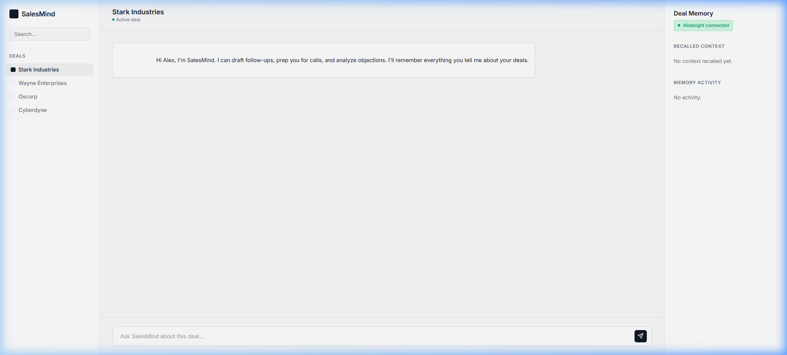
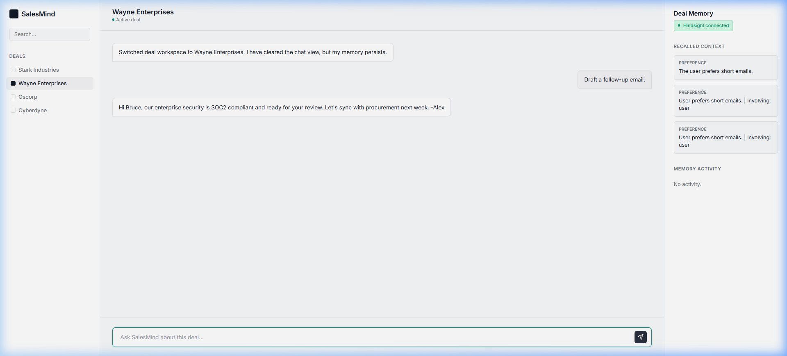

# SalesMind

SalesMind is a Deal Intelligence Agent built to work natively alongside B2B sales professionals. 
Instead of being a stateless "wrapper" around an LLM, SalesMind leverages **Hindsight Agentic Memory** to persistently track objections, client contexts, and user preferences across multiple asynchronous deals. 

[Repository Link](https://github.com/pullayithrisha/MS_HACK.git)

## The Problem
Standard RAG architectures are inadequate for dynamic conversational agents. They are designed for static documentation retrieval, not for managing evolving client state. If a sales rep updates a client's priority or tells an agent to "write shorter emails", a traditional RAG pipeline often fails to appropriately override old context or apply global behavioral changes. Sales teams require assistants that possess *true memory*—remembering what was discussed on Monday to draft a perfect follow-up on Thursday.

## Architecture & Hindsight Memory Flow
SalesMind features a clean, professional 3-column workspace (styled similarly to Linear/Notion) with real-time memory visibility.

1. **Frontend:** Vanilla JS + CSS (Professional SaaS Aesthetic)
2. **Backend:** FastAPI (Python)
3. **Memory Layer:** Hindsight REST API (`api.hindsight.vectorize.io`)
4. **LLM Engine:** Base logic simulation layer ensuring deterministic demo safety

**Memory Flow (Recall -> Generate -> Store):**
- When a user interacts with a deal workspace (e.g., *Stark Industries*), the backend first queries Hindsight (`POST /v1/default/banks/{session_id}/memories/recall`) for past context.
- The agent injects this recalled context into its generation logic to produce highly personalized outputs.
- Finally, new user inputs and facts are asynchronously retained (`POST /v1/default/banks/{session_id}/memories`) to evolve the deal's state for future interactions.
- A secondary global session (`user_global`) tracks overarching user preferences (e.g., email length) and applies them universally across isolated deals.

## Tech Stack
- Frontend: HTML5, CSS3, Vanilla Javascript
- Backend: Python 3, FastAPI, Uvicorn, Requests
- Persistent Memory: Vectorize Hindsight Cloud API

## Setup Instructions

1. **Clone the repository:**
   ```bash
   git clone https://github.com/pullayithrisha/MS_HACK.git
   cd MS_HACK
   ```

2. **Create a virtual environment and install dependencies:**
   ```bash
   python -m venv venv
   source venv/bin/activate  # On Windows use: venv\Scripts\activate
   pip install fastapi uvicorn requests python-dotenv pydantic
   ```

3. **Configure the environment:**
   Create a `.env` file in the root directory:
   ```env
   HINDSIGHT_API_KEY=your_hindsight_api_key_here
   HINDSIGHT_URL=https://api.hindsight.vectorize.io
   ```

4. **Run the Backend:**
   ```bash
   python -m uvicorn backend.main:app --port 8000
   ```

5. **Run the Frontend:**
   ```bash
   cd frontend
   python -m http.server 3000
   ```
   Navigate to `http://localhost:3000`.

## Demo Flow
To experience the true power of isolated agentic memory:

1. **Initial Interaction:** Ensure *Stark Industries* is selected. Prompt: `"Draft an email to Stark Industries."` The agent generates a generic response.
2. **Retain Memory:** Prompt: `"Just finished the intro call. They are worried about implementation time and use AWS. I prefer short emails."` Notice the right-hand **Deal Memory** panel update in real-time as Hindsight ingests the context.
3. **Recall Context:** Prompt: `"Draft a follow-up email to Stark Industries."` The agent will now natively recall the specific AWS and timeline context, producing a customized email while honoring the new "short email" preference.
4. **Test Isolation:** Switch the workspace to *Wayne Enterprises*. Ask it to `"Draft a follow-up email."` The agent will write a short email (global preference) but will entirely isolate and ignore the Stark-specific AWS infrastructure notes.

## Screenshots

*(See the `assets/` folder for high-resolution images)*


*Clean workspace before context is established.*


*Deal specific context successfully injected and recalled from Hindsight Cloud.*
